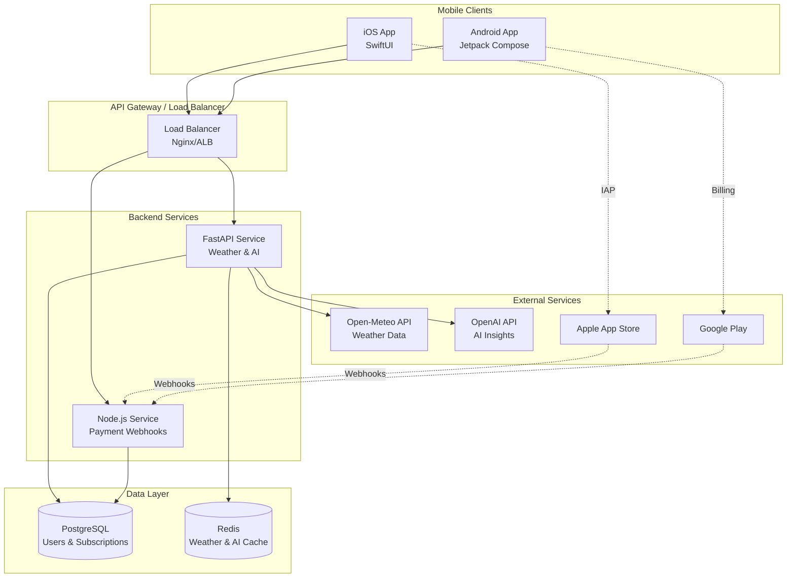
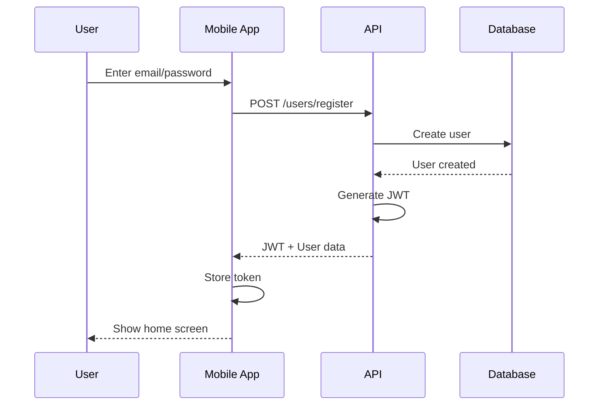
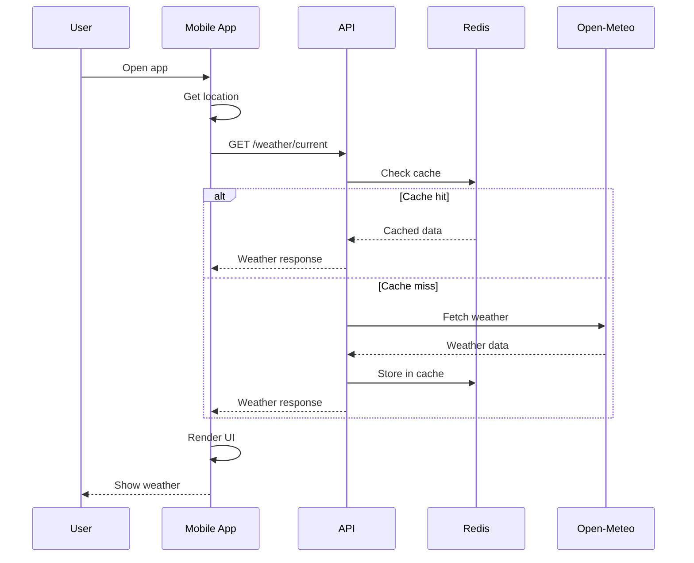
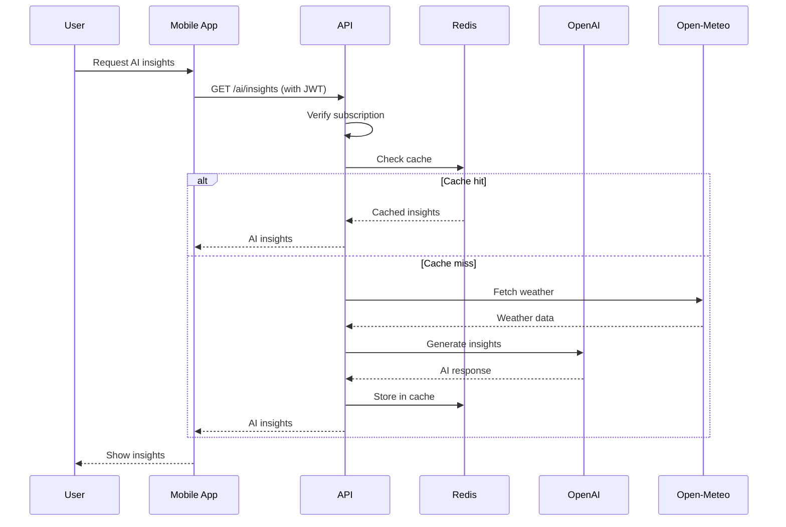
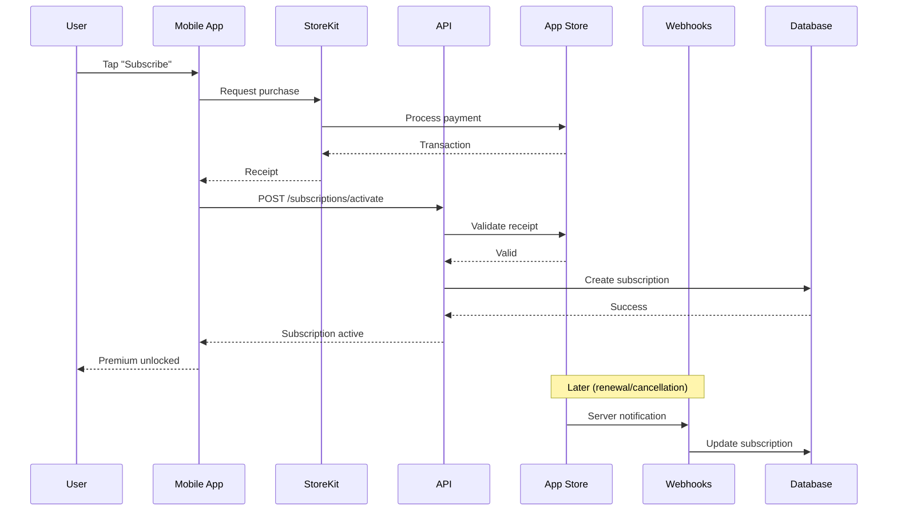

# ClimaAI System Architecture

## Overview

ClimaAI is a production-ready, subscription-based AI weather application built with a modern microservices architecture. The system consists of backend services (FastAPI + Node.js), mobile applications (iOS SwiftUI + Android Jetpack Compose), and supporting infrastructure.

## High-Level Architecture



## Component Details

### 1. Mobile Applications

#### iOS App (SwiftUI)

**Technologies:**
- SwiftUI for UI
- Combine for reactive programming
- StoreKit 2 for subscriptions
- CoreLocation for geolocation
- URLSession for networking

**Architecture Pattern:** MVVM

```
ClimaAI/
├── Models/          # Data models
├── Views/          # UI components
├── ViewModels/     # Business logic
├── Services/       # API, Location, Subscription
└── Utils/          # Helpers, extensions
```

**Key Features:**
- Offline-first with local caching
- Background weather updates
- Push notifications support
- Accessibility (VoiceOver, Dynamic Type)
- Dark mode

#### Android App (Jetpack Compose)

**Technologies:**
- Jetpack Compose for UI
- Kotlin Coroutines & Flow
- Google Play Billing Library 6
- FusedLocationProvider
- Retrofit for networking
- Room for local database

**Architecture Pattern:** MVVM + Clean Architecture

```
app/
└── src/main/kotlin/com/climaai/app/
    ├── data/       # Models, repositories
    ├── domain/     # Use cases
    ├── ui/         # Composables, ViewModels
    └── utils/      # Helpers
```

**Key Features:**
- Material 3 design
- Offline support with Room
- WorkManager for background tasks
- Firebase Cloud Messaging
- TalkBack accessibility

### 2. Backend Services

#### FastAPI Service (Python)

**Responsibilities:**
- Weather data aggregation
- AI insight generation
- User management
- Subscription validation
- API authentication

**Tech Stack:**
- FastAPI (async framework)
- SQLAlchemy (ORM)
- Pydantic (validation)
- asyncpg (PostgreSQL driver)
- redis-py (caching)
- httpx (HTTP client)
- OpenAI Python SDK

**Endpoints:**
- `/users/*` - User management
- `/weather/*` - Weather data
- `/ai/*` - AI insights (premium)
- `/subscriptions/*` - Subscription management
- `/health` - Health check

**Key Patterns:**
- Dependency injection
- Repository pattern
- Service layer
- Schema validation
- Async/await throughout

#### Payment Webhook Service (Node.js)

**Responsibilities:**
- Apple App Store Server Notifications
- Google Play Developer Notifications
- Subscription status updates

**Tech Stack:**
- Express.js
- pg (PostgreSQL client)
- jsonwebtoken (JWS verification)

**Endpoints:**
- `/webhooks/apple` - Apple notifications
- `/webhooks/google` - Google notifications
- `/health` - Health check

**Security:**
- JWS signature verification (Apple)
- Pub/Sub message validation (Google)
- Idempotent processing

### 3. Data Layer

#### PostgreSQL Database

**Schema:**

```sql
users
├── id (UUID, PK)
├── email (UNIQUE)
├── password_hash
├── preferences (JSONB)
└── timestamps

subscriptions
├── id (UUID, PK)
├── user_id (FK)
├── platform (apple/google)
├── plan (monthly/annual)
├── status (trial/active/expired/#...)
├── trial_dates
├── subscription_dates
├── platform_transaction_ids
└── timestamps
```

**Indexes:**
- `users.email` - B-tree
- `subscriptions.user_id` - B-tree
- `subscriptions.status` - B-tree
- `subscriptions.apple_transaction_id` - B-tree
- `subscriptions.google_purchase_token` - B-tree

**Constraints:**
- Foreign keys with CASCADE delete
- CHECK constraints on enums
- UNIQUE constraints on emails

#### Redis Cache

**Cache Strategy:**

1. **Weather Data** (TTL: 30 minutes)
   - Key: `weather:complete:{lat}:{lon}`
   - Reduces Open-Meteo API calls
   - Saves bandwidth

2. **AI Insights** (TTL: 1 hour)
   - Key: `ai:{type}:{lat}:{lon}:{date}`
   - Reduces OpenAI API costs
   - Per-day caching

**Cache Invalidation:**
- Time-based expiration
- No manual invalidation needed
- Weather updates every 30 minutes

### 4. External APIs

#### Open-Meteo API

**Usage:**
- Current weather
- Hourly forecast (up to 168 hours)
- Daily forecast (up to 16 days)
- Air quality data

**Rate Limits:**
- Free tier: 10,000 requests/day
- No API key required
- Global endpoint

**Endpoints:**
- `https://api.open-meteo.com/v1/forecast`
- `https://air-quality.open-meteo.com/v1/air-quality`

#### OpenAI API

**Usage:**
- Daily weather summaries
- Outfit recommendations
- Activity suggestions
- Health insights

**Models:**
- Primary: GPT-4 Turbo
- Fallback: GPT-3.5 Turbo (cost saving)

**Cost Optimization:**
- Aggressive caching (1-hour TTL)
- Prompt optimization
- Structured output (JSON mode)
- Token limits (500-600 tokens)

**Monthly Cost Estimate:**
- 10,000 users, 5 requests/user/day
- ~$150-300/month (GPT-4 Turbo)
- ~$20-40/month (GPT-3.5 Turbo)

## Data Flow

### User Registration Flow



### Weather Fetch Flow



### AI Insights Flow (Premium)



### Subscription Purchase Flow (iOS)



## Security Architecture

### Authentication & Authorization

**Flow:**
1. User registers/logs in
2. Server generates JWT with user ID
3. Client stores JWT securely (Keychain/EncryptedSharedPreferences)
4. Subsequent requests include JWT in Authorization header
5. Server validates JWT and extracts user ID

**JWT Payload:**
```json
{
  "sub": "user-uuid",
  "exp": 1704067200,
  "iat": 1701475200
}
```

**Security Measures:**
- bcrypt password hashing (12 rounds)
- JWT secret stored in environment variables
- Token expiration (30 days)
- HTTPS only in production
- Rate limiting (100 req/hour free, 1000 req/hour premium)

### API Security

**Protection Mechanisms:**
- CORS configured (whitelist origins)
- SQL injection prevention (SQLAlchemy parameterized queries)
- XSS protection (no HTML rendering)
- Input validation (Pydantic schemas)
- Request size limits
- Timeout limits

### Data Privacy

**User Data:**
- Location: Used only for weather requests, not stored
- Email: Stored hashed
- Password: bcrypt hashed, never logged
- Preferences: Encrypted at rest

**Compliance:**
- GDPR ready (data export/deletion)
- CCPA compliant
- Privacy policy provided
- User consent required

### Subscription Security

**Receipt Validation:**
- Apple: JWS signature verification with Apple's public key
- Google: Purchase token verification via Play Developer API
- Server-side validation (never trust client)

## Scalability

### Horizontal Scaling

**Stateless API:**
- Multiple API instances behind load balancer
- Session-less (JWT)
- Shared Redis cache
- Database connection pooling

**Auto-Scaling Triggers:**
- CPU > 70%
- Memory > 80%
- Request queue depth > 100

### Database Scaling

**Read Replicas:**
- Weather lookups → Read replica
- User writes → Primary
- Eventual consistency acceptable

**Connection Pooling:**
- Pool size: 10 per instance
- Max overflow: 20
- Pool pre-ping enabled

### Caching Strategy

**Levels:**
1. **Client cache:** Recent weather (5 minutes)
2. **Redis cache:** API responses (30-60 minutes)
3. **CDN cache:** Static assets (infinite)

### Cost Optimization

**Current Architecture:**
- API: 2 instances (2 vCPU, 4GB RAM each)
- Database: Single instance (2 vCPU, 8GB RAM)
- Redis: Single instance (1 vCPU, 2GB RAM)

**Estimated Monthly Cost:**
- AWS: ~$150-200
- GCP: ~$120-180
- DigitalOcean: ~$80-120
- OpenAI API: ~$150-300
- **Total: ~$350-620/month**

**At Scale (100K users):**
- API: 10 instances
- Database: Primary + 2 read replicas
- Redis: 3-node cluster
- OpenAI: ~$1,500-3,000
- **Total: ~$4,000-6,000/month**

**Revenue at 100K users (5% conversion):**
- 5,000 premium × $4.99/month = $24,950/month
- Minus platform fees (25%) = $18,713/month
- Minus infrastructure (~$5,000) = $13,713/month profit

## Monitoring & Observability

### Metrics

**Application Metrics:**
- Request rate
- Response time (p50, p95, p99)
- Error rate
- Cache hit rate

**Business Metrics:**
- Daily Active Users (DAU)
- Monthly Active Users (MAU)
- Trial conversion rate
- Churn rate
- Revenue

### Logging

**Structured Logging:**
```json
{
  "timestamp": "2024-01-01T12:00:00Z",
  "level": "INFO",
  "service": "api",
  "trace_id": "abc123",
  "user_id": "user-uuid",
  "endpoint": "/weather/current",
  "duration_ms": 156,
  "status": 200
}
```

**Log Levels:**
- DEBUG: Development only
- INFO: Key operations
- WARNING: Recoverable errors
- ERROR: Unrecoverable errors
- CRITICAL: System failures

### Alerting

**Critical Alerts:**
- API down (health check fails)
- Database unreachable
- Error rate > 5%
- Payment webhook failures

**Warning Alerts:**
- Response time > 1s (p95)
- Cache hit rate < 70%
- Disk usage > 80%
- OpenAI API rate limit approaching

## Disaster Recovery

### Backups

**Database:**
- Automated daily backups
- Point-in-time recovery (7 days)
- Backup retention: 30 days
- Off-site storage (S3/Cloud Storage)

**Redis:**
- RDB snapshots every 6 hours
- AOF for durability
- Replica for high availability

### Recovery Procedures

**RTO/RPO:**
- RTO (Recovery Time Objective): 1 hour
- RPO (Recovery Point Objective): 24 hours

**Incident Response:**
1. Detect (monitoring alerts)
2. Assess (severity, impact)
3. Contain (failover, rollback)
4. Resolve (fix, deploy)
5. Post-mortem (document, improve)

## Future Enhancements

### Short-term (v1.1-1.2)

- [ ] Weather widgets (iOS/Android)
- [ ] Push notifications for alerts
- [ ] Multiple location support
- [ ] Historical weather data
- [ ] Weather radar overlay

### Medium-term (v1.3-2.0)

- [ ] Apple Watch / Wear OS apps
- [ ] Hyperlocal forecasting
- [ ] Weather-based automations
- [ ] Social features (share weather)
- [ ] Voice assistant integration

### Long-term (v2.0+)

- [ ] AR weather visualization
- [ ] Community weather reports
- [ ] Advanced AI (GPT-5, multi-modal)
- [ ] Global expansion & localization
- [ ] B2B weather API offering

---

**Architecture designed for scalability, reliability, and cost-efficiency** ✨
